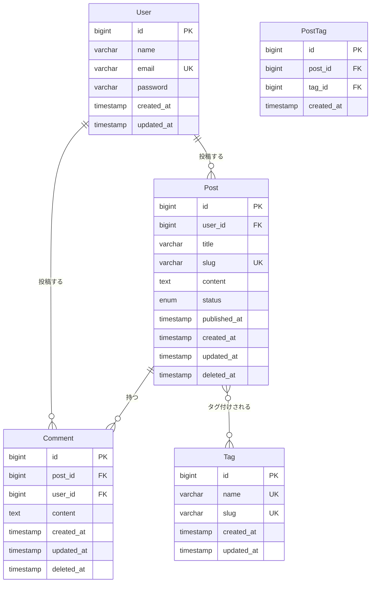

# ブログシステム要件定義書

プロジェクト識別子: `blog`  
作成日: 2026-01-07  
バージョン: 1.0.0

---

## 1. 背景・目的

本プロジェクトは、ユーザーが記事を投稿し、他のユーザーとコミュニケーションできるブログプラットフォームを構築することを目的とする。現代のWebコミュニティにおいて、情報発信と意見交換の場を提供することで、ナレッジシェアリングとコミュニティ形成を促進する。投稿機能を中心に、コメント機能による双方向コミュニケーション、タグ機能によるコンテンツの分類・発見性の向上を実現し、ユーザーエンゲージメントの高いプラットフォームを目指す。Laravel 12フレームワークを活用し、保守性と拡張性に優れたモダンなWebアプリケーションとして開発する。

---

## 2. スコープ / 非スコープ

### スコープ（実装対象）

- ユーザー認証・認可機能（登録、ログイン、ログアウト）
- ブログ記事の投稿・編集・削除機能（CRUD操作）
- マークダウン形式での記事作成対応
- 記事へのコメント投稿・編集・削除機能
- タグの作成・記事への紐付け・タグによる記事検索機能
- 記事一覧表示（ページネーション付き）
- タグ別記事一覧表示
- 記事詳細表示とコメント表示
- 投稿者別記事一覧表示
- 記事の公開/下書きステータス管理
- レスポンシブデザイン対応のユーザーインターフェース
- Bladeテンプレートによるサーバーサイドレンダリング

### 非スコープ（実装対象外）

- SNSログイン連携（OAuth実装）
- 記事への画像/動画アップロード機能
- いいね機能・お気に入り機能
- フォロー/フォロワー機能
- リアルタイム通知機能
- 記事の検索機能（全文検索）
- 多言語対応（国際化・i18n）
- モバイルアプリケーション開発
- 管理者用ダッシュボード
- アナリティクス機能

---

## 3. ステークホルダー & 主要ユースケース

### ステークホルダー

- **記事投稿者**: ブログ記事を作成・公開・管理するユーザー
- **閲覧者**: 記事を読み、コメントを通じて交流するユーザー
- **システム管理者**: アプリケーションの運用・保守を担当する技術者
- **プロダクトオーナー**: ビジネス要件を定義し、優先順位を決定する責任者

### 主要ユースケース

1. **記事投稿**: ユーザーが新規ブログ記事を作成し、タグを付けて公開する
2. **記事閲覧**: ユーザーが記事一覧から興味のある記事を選択して詳細を閲覧する
3. **コメント投稿**: 記事を読んだユーザーが感想や質問をコメントとして投稿する
4. **タグ検索**: ユーザーが特定のタグをクリックし、関連する記事一覧を取得する
5. **記事管理**: 投稿者が自身の記事を編集または削除する

---

## 4. 機能要件（EARS形式）

### Ubiquitous Requirements（常時要件）

**R-001**: システムは、全てのHTTP通信においてHTTPS（TLS 1.3以上）を使用しなければならない。

**R-002**: システムは、ユーザーからの全ての入力データに対してXSS対策（HTMLエスケープ）とSQLインジェクション対策（プリペアドステートメント）を実施しなければならない。

**R-003**: システムは、全てのHTTPリクエストにおいて、レスポンスタイム p95 ≤ 300ミリ秒を維持しなければならない。

### State-driven Requirements（状態駆動要件）

**R-004**: ユーザーがログイン済み状態である場合、システムは記事投稿フォーム、コメント投稿フォーム、および自身の記事編集機能を提供しなければならない。

**R-005**: 記事が「下書き」ステータスである場合、システムは当該記事を投稿者本人のみに表示し、他のユーザーからは非表示としなければならない。

**R-006**: ユーザーがログアウト状態である場合、システムは記事一覧と記事詳細の閲覧のみを許可し、投稿・編集・削除・コメント機能へのアクセスを403エラーで拒否しなければならない。

### Event-driven Requirements（イベント駆動要件）

**R-007**: ユーザーが記事投稿ボタンをクリックした時、システムは入力検証を実行し、タイトル（1文字以上200文字以下）、本文（1文字以上10,000文字以下）の必須チェックを行い、検証エラー時には3秒以内にエラーメッセージを表示しなければならない。

**R-008**: ユーザーがタグをクリックした時、システムは当該タグが紐付けられた記事一覧を500ミリ秒以内に表示しなければならない。

**R-009**: ユーザーが記事削除を実行した時、システムは確認ダイアログを表示し、承認後に記事と関連する全てのコメントを論理削除（ソフトデリート）しなければならない。

**R-010**: データベース接続エラーが発生した時、システムはユーザーに500エラーページを表示し、エラー詳細をログファイル（storage/logs/laravel.log）に記録しなければならない。

---

## 5. ユーザーストーリー（INVEST + MoSCoW）

### US-001: 記事の新規投稿 [Must Have]

**As a** 記事投稿者  
**I want to** タイトル、本文、タグを入力して新規記事を投稿できる  
**So that** 自分の知識や意見を他のユーザーと共有できる

**INVEST評価**:
- Independent: 他のストーリーに依存しない
- Negotiable: タグの数、本文の長さ制限は調整可能
- Valuable: ブログの中核機能
- Estimable: 5ストーリーポイント（3日間）
- Small: 1スプリント内で完了可能
- Testable: 投稿成功/失敗を検証可能

---

### US-002: 記事一覧の閲覧 [Must Have]

**As a** 閲覧者  
**I want to** 最新の記事一覧をページネーション付きで閲覧できる  
**So that** 興味のある記事を見つけられる

**INVEST評価**:
- Independent: 独立して実装可能
- Negotiable: 1ページあたりの表示件数は調整可能
- Valuable: ユーザーエンゲージメントに直結
- Estimable: 3ストーリーポイント（2日間）
- Small: 1スプリント内で完了可能
- Testable: 表示件数、ページング動作を検証可能

---

### US-003: 記事詳細の閲覧 [Must Have]

**As a** 閲覧者  
**I want to** 記事の全文とコメント一覧を閲覧できる  
**So that** 詳細な情報と他者の意見を確認できる

**INVEST評価**:
- Independent: 記事一覧から独立
- Negotiable: コメント表示順は調整可能
- Valuable: コンテンツ消費の中心機能
- Estimable: 2ストーリーポイント（1日間）
- Small: 1スプリント内で完了可能
- Testable: 表示内容を検証可能

---

### US-004: コメントの投稿 [Must Have]

**As a** ログイン済みユーザー  
**I want to** 記事に対してコメントを投稿できる  
**So that** 記事に対する感想や質問を共有できる

**INVEST評価**:
- Independent: 記事投稿とは独立
- Negotiable: コメント文字数制限は調整可能
- Valuable: コミュニティ形成に必須
- Estimable: 3ストーリーポイント（2日間）
- Small: 1スプリント内で完了可能
- Testable: コメント保存・表示を検証可能

---

### US-005: タグによる記事検索 [Should Have]

**As a** 閲覧者  
**I want to** タグをクリックして関連記事一覧を表示できる  
**So that** 特定のトピックに関する記事を効率的に見つけられる

**INVEST評価**:
- Independent: 他の検索機能とは独立
- Negotiable: タグ表示順は調整可能
- Valuable: コンテンツ発見性を向上
- Estimable: 3ストーリーポイント（2日間）
- Small: 1スプリント内で完了可能
- Testable: フィルタリング結果を検証可能

---

### US-006: 記事の編集 [Must Have]

**As a** 記事投稿者  
**I want to** 自分が投稿した記事を編集できる  
**So that** 誤字脱字の修正や内容の更新ができる

**INVEST評価**:
- Independent: 新規投稿とは別機能
- Negotiable: 編集履歴の保存有無は調整可能
- Valuable: コンテンツ品質維持に必須
- Estimable: 2ストーリーポイント（1日間）
- Small: 1スプリント内で完了可能
- Testable: 編集内容の反映を検証可能

---

### US-007: 記事の削除 [Must Have]

**As a** 記事投稿者  
**I want to** 自分が投稿した記事を削除できる  
**So that** 不要になった記事を管理できる

**INVEST評価**:
- Independent: 独立した機能
- Negotiable: 物理削除/論理削除は調整可能
- Valuable: データ管理に必須
- Estimable: 2ストーリーポイント（1日間）
- Small: 1スプリント内で完了可能
- Testable: 削除動作を検証可能

---

### US-008: 下書き保存 [Should Have]

**As a** 記事投稿者  
**I want to** 記事を下書きとして保存できる  
**So that** 完成前の記事を一時保存し、後で編集を再開できる

**INVEST評価**:
- Independent: 公開機能とは独立
- Negotiable: 下書き保存期限は調整可能
- Valuable: ユーザー体験を向上
- Estimable: 2ストーリーポイント（1日間）
- Small: 1スプリント内で完了可能
- Testable: ステータス管理を検証可能

---

### US-009: コメントの編集・削除 [Could Have]

**As a** コメント投稿者  
**I want to** 自分のコメントを編集・削除できる  
**So that** 誤った内容を修正または取り消せる

**INVEST評価**:
- Independent: 独立した機能
- Negotiable: 編集期限は調整可能
- Valuable: ユーザー満足度を向上
- Estimable: 2ストーリーポイント（1日間）
- Small: 1スプリント内で完了可能
- Testable: 編集・削除動作を検証可能

---

### US-010: 投稿者別記事一覧 [Could Have]

**As a** 閲覧者  
**I want to** 特定の投稿者の記事一覧を表示できる  
**So that** 気に入った投稿者の他の記事を見つけられる

**INVEST評価**:
- Independent: 独立した機能
- Negotiable: 表示順は調整可能
- Valuable: ユーザーエンゲージメントを向上
- Estimable: 2ストーリーポイント（1日間）
- Small: 1スプリント内で完了可能
- Testable: フィルタリング結果を検証可能

---

## 6. 受け入れ基準（Gherkin形式）

### US-001の受け入れ基準

**AC-001-01: 正常系 - 記事投稿成功**

```gherkin
Given ユーザーがログイン済みである
And 記事投稿フォームを開いている
When タイトルに「Laravel 12の新機能」と入力する
And 本文に「Laravel 12では...」（100文字）と入力する
And タグとして「Laravel」「PHP」を選択する
And 「公開する」ボタンをクリックする
Then 記事がデータベースに保存される
And 記事一覧ページにリダイレクトされる
And 「記事を投稿しました」という成功メッセージが表示される
And レスポンスタイムが500ミリ秒以内である
```

**AC-001-02: 異常系 - 必須項目未入力**

```gherkin
Given ユーザーがログイン済みである
And 記事投稿フォームを開いている
When タイトルを空のままにする
And 本文に「Laravel 12では...」と入力する
And 「公開する」ボタンをクリックする
Then 記事はデータベースに保存されない
And 投稿フォームにとどまる
And 「タイトルは必須です」というエラーメッセージが表示される
And エラー表示までのレスポンスタイムが200ミリ秒以内である
```

**AC-001-03: 異常系 - 文字数制限超過**

```gherkin
Given ユーザーがログイン済みである
And 記事投稿フォームを開いている
When タイトルに201文字の文字列を入力する
And 「公開する」ボタンをクリックする
Then 記事はデータベースに保存されない
And 「タイトルは200文字以内で入力してください」というエラーメッセージが表示される
```

**AC-001-04: 雨天シナリオ - データベース接続エラー**

```gherkin
Given ユーザーがログイン済みである
And データベース接続が利用不可である
When 有効な記事データで「公開する」ボタンをクリックする
Then 500エラーページが表示される
And エラー詳細がログファイルに記録される
And 「システムエラーが発生しました。しばらく待ってから再度お試しください」というメッセージが表示される
```

**AC-001-05: セキュリティ - XSS対策**

```gherkin
Given ユーザーがログイン済みである
When タイトルに「<script>alert('XSS')</script>」と入力する
And 「公開する」ボタンをクリックする
Then 記事がデータベースに保存される
And 記事詳細ページでスクリプトが実行されず、エスケープされたテキストとして表示される
```

---

### US-002の受け入れ基準

**AC-002-01: 正常系 - 記事一覧表示**

```gherkin
Given データベースに30件の公開記事が存在する
When 記事一覧ページにアクセスする
Then 最新の15件の記事がタイトル、投稿者名、投稿日時とともに表示される
And ページネーションコントロールが表示される
And 総ページ数が「2」と表示される
And ページ読み込み時間が400ミリ秒以内である
```

**AC-002-02: 正常系 - ページング動作**

```gherkin
Given 記事一覧の1ページ目を表示している
When 「次へ」ボタンをクリックする
Then 2ページ目に遷移する
And 16件目から30件目の記事が表示される
And URLが「/posts?page=2」に変更される
```

**AC-002-03: 異常系 - 記事が0件**

```gherkin
Given データベースに公開記事が0件である
When 記事一覧ページにアクセスする
Then 「まだ記事が投稿されていません」というメッセージが表示される
And ページネーションコントロールは表示されない
```

**AC-002-04: エッジケース - 非常に多数の記事**

```gherkin
Given データベースに10,000件の公開記事が存在する
When 記事一覧ページにアクセスする
Then ページ読み込み時間が500ミリ秒以内である
And メモリ使用量が256MB以下である
```

---

### US-004の受け入れ基準

**AC-004-01: 正常系 - コメント投稿成功**

```gherkin
Given ユーザーがログイン済みである
And 記事詳細ページを表示している
When コメント入力欄に「参考になりました」と入力する
And 「コメントを投稿」ボタンをクリックする
Then コメントがデータベースに保存される
And コメント一覧に新しいコメントが表示される
And 「コメントを投稿しました」という成功メッセージが表示される
And レスポンスタイムが300ミリ秒以内である
```

**AC-004-02: 異常系 - ログイン未済**

```gherkin
Given ユーザーがログアウト状態である
And 記事詳細ページを表示している
When コメント投稿を試みる
Then コメント入力フォームが表示されない
And 「コメントするにはログインしてください」というメッセージが表示される
And ログインページへのリンクが表示される
```

**AC-004-03: 異常系 - 空コメント**

```gherkin
Given ユーザーがログイン済みである
When コメント入力欄を空のままにする
And 「コメントを投稿」ボタンをクリックする
Then コメントはデータベースに保存されない
And 「コメントを入力してください」というエラーメッセージが表示される
```

**AC-004-04: 雨天シナリオ - レート制限超過**

```gherkin
Given ユーザーが1分間に10件のコメントを投稿した
When 11件目のコメント投稿を試みる
Then コメントは保存されない
And 429エラーが返される
And 「コメント投稿が多すぎます。しばらく待ってから再度お試しください」というメッセージが表示される
```

---

### US-005の受け入れ基準

**AC-005-01: 正常系 - タグによるフィルタリング**

```gherkin
Given タグ「Laravel」が5件の記事に紐付けられている
And タグ「PHP」が3件の記事に紐付けられている
When 記事一覧でタグ「Laravel」をクリックする
Then 「Laravel」タグの5件の記事のみが表示される
And URLが「/posts?tag=Laravel」に変更される
And ページ上部に「タグ: Laravel」という表示がある
And レスポンスタイムが400ミリ秒以内である
```

**AC-005-02: 正常系 - タグが存在しない**

```gherkin
Given データベースに存在しないタグ「NonExistent」を指定する
When 「/posts?tag=NonExistent」にアクセスする
Then 「該当する記事が見つかりません」というメッセージが表示される
And 記事一覧は空である
```

**AC-005-03: 正常系 - タグの一覧表示**

```gherkin
Given システムに10個のタグが登録されている
When 記事一覧ページにアクセスする
Then サイドバーに全タグが表示される
And 各タグの記事数が表示される（例: Laravel (5)）
And タグは記事数の多い順に並んでいる
```

---

### US-007の受け入れ基準

**AC-007-01: 正常系 - 記事削除成功**

```gherkin
Given ユーザーがログイン済みである
And 自分が投稿した記事が存在する
When 記事詳細ページで「削除」ボタンをクリックする
And 確認ダイアログで「OK」を選択する
Then 記事が論理削除される（deleted_atが設定される）
And 記事一覧に当該記事が表示されなくなる
And 「記事を削除しました」という成功メッセージが表示される
And 記事一覧ページにリダイレクトされる
```

**AC-007-02: 異常系 - 他人の記事削除を試行**

```gherkin
Given ユーザーAがログイン済みである
And ユーザーBが投稿した記事が存在する
When ユーザーAがユーザーBの記事削除を試みる
Then 403 Forbiddenエラーが返される
And 「この操作を実行する権限がありません」というメッセージが表示される
And 記事は削除されない
```

**AC-007-03: 正常系 - 関連コメントの削除**

```gherkin
Given 記事Aに5件のコメントが紐付けられている
When 記事Aを削除する
Then 記事Aに紐付く全てのコメントが論理削除される
And 記事詳細ページにアクセスすると404エラーが返される
```

---

## 7. 非機能要件（ISO/IEC 25010 + 数値定量化）

### 7.1 Performance Efficiency（性能効率性）

**NFR-001: レスポンスタイム**
- HTTPリクエスト応答時間: p50 ≤ 100ミリ秒、p95 ≤ 300ミリ秒、p99 ≤ 500ミリ秒
- ページ読み込み時間: 初回ロード ≤ 2秒、以降のページ遷移 ≤ 1秒
- 測定ツール: Laravel Telescope、New Relic APM

**NFR-002: スループット**
- 同時接続ユーザー数: 100ユーザー時に秒間50リクエスト処理可能
- データベースクエリ: 1ページあたり平均 ≤ 15クエリ（N+1問題の回避）
- 測定ツール: Apache JMeter、Laravel Debugbar

**NFR-003: リソース使用効率**
- メモリ使用量: 通常時 ≤ 256MB、ピーク時 ≤ 512MB
- CPU使用率: 平均 ≤ 30%、ピーク時 ≤ 70%
- データベース接続プール: 最小5接続、最大20接続
- 測定ツール: Docker stats、MySQL Performance Schema

---

### 7.2 Compatibility（互換性）

**NFR-004: ブラウザ互換性**
- 対応ブラウザ: Chrome（最新版 + 1つ前）、Firefox（最新版 + 1つ前）、Safari（最新版）、Edge（最新版）
- シェア ≥ 95%のブラウザで動作保証

**NFR-005: デバイス互換性**
- レスポンシブ対応: 画面幅 320px（モバイル）〜 1920px（デスクトップ）で適切に表示
- タッチデバイス対応: タップ、スワイプ操作をサポート

**NFR-006: 環境互換性**
- PHP: 8.2以上（推奨 8.5）
- Laravel: 12.x系
- MySQL: 8.0以上 または PostgreSQL: 14以上
- Redis: 7.0以上（キャッシュ・セッション管理）

---

### 7.3 Usability（使用性）

**NFR-007: 学習容易性**
- 新規ユーザーが記事投稿まで ≤ 5分で到達可能
- ユーザビリティテストでタスク完了率 ≥ 90%

**NFR-008: アクセシビリティ**
- WCAG 2.1レベルAA準拠
- キーボード操作のみで全機能にアクセス可能
- スクリーンリーダー（NVDA、JAWS）対応
- 色のコントラスト比: 通常テキスト ≥ 4.5:1、大きなテキスト ≥ 3:1

**NFR-009: エラーメッセージ**
- 全エラーメッセージは具体的で実行可能な解決策を含む
- エラー検出から表示まで ≤ 3秒

---

### 7.4 Reliability（信頼性）

**NFR-010: 可用性**
- システム稼働率: ≥ 99.5%（月間ダウンタイム ≤ 3.6時間）
- 計画メンテナンス: 月1回、深夜2時〜4時（最大2時間）

**NFR-011: 障害回復性**
- データベース障害時の復旧時間（RTO）: ≤ 1時間
- データ損失許容時間（RPO）: ≤ 15分（15分ごとのバックアップ）
- 自動リトライ: データベース接続失敗時3回まで再試行（間隔: 1秒、2秒、4秒）

**NFR-012: 耐障害性**
- データベース接続プールの枯渇時にグレースフルデグラデーション
- キャッシュ障害時も基本機能（読み取り）は動作継続

---

### 7.5 Security（セキュリティ）

**NFR-013: 認証・認可**
- パスワードポリシー: 最小8文字、大文字・小文字・数字を含む
- セッションタイムアウト: 無操作30分で自動ログアウト
- パスワードハッシュ: bcrypt（cost=12）またはArgon2id

**NFR-014: データ保護**
- 全HTTP通信でHTTPS（TLS 1.3）を使用
- 個人情報（メールアドレス）は暗号化して保存
- CSRF保護: 全フォームでトークン検証

**NFR-015: 入力検証**
- 全ユーザー入力でサーバーサイド検証実施
- SQLインジェクション対策: Eloquent ORMのプリペアドステートメント使用
- XSS対策: Blade テンプレートの自動エスケープ + CSP（Content Security Policy）ヘッダー

**NFR-016: レート制限**
- ログイン試行: 5分間に5回まで、超過時15分間ロック
- フォーム送信: 認証済みユーザー 60リクエスト/分、未認証 20リクエスト/分
- コメント投稿: 1分間に10件まで

---

### 7.6 Maintainability（保守性）

**NFR-017: コード品質**
- PSR-12コーディング規約遵守率: 100%（PHP_CodeSniffer）
- コードカバレッジ: ≥ 70%（単体テスト + 統合テスト）
- 循環的複雑度: 1メソッドあたり ≤ 10

**NFR-018: モジュール性**
- 単一責任原則: 1クラス1責務
- 依存性注入: Service ContainerとDIコンテナを活用
- レイヤー分離: Controller → Service → Repository の3層アーキテクチャ

**NFR-019: ログ・監視**
- アプリケーションログ: INFO以上を記録（ERROR、WARNING、INFO）
- ログローテーション: 日次、30日保持
- 監視メトリクス: レスポンスタイム、エラー率、データベース接続数を1分ごとに記録

---

### 7.7 Portability（移植性）

**NFR-020: 環境適応性**
- 開発環境: Laravel Sailで構築、`./vendor/bin/sail up -d && ./vendor/bin/sail artisan migrate` で起動可能
- 本番環境: AWS、GCP、Azureの主要クラウドプラットフォームで動作
- 設定管理: .envファイルで環境別設定を分離

---

## 8. データモデル

### 8.1 主要エンティティ

#### User（ユーザー）

| カラム名 | データ型 | 制約 | 説明 |
|---------|---------|-----|------|
| id | BIGINT | PK, AUTO_INCREMENT | ユーザーID |
| name | VARCHAR(100) | NOT NULL | ユーザー名 |
| email | VARCHAR(255) | NOT NULL, UNIQUE | メールアドレス |
| email_verified_at | TIMESTAMP | NULL | メール確認日時 |
| password | VARCHAR(255) | NOT NULL | パスワードハッシュ |
| remember_token | VARCHAR(100) | NULL | ログイン保持トークン |
| created_at | TIMESTAMP | NOT NULL | 作成日時 |
| updated_at | TIMESTAMP | NOT NULL | 更新日時 |

#### Post（記事）

| カラム名 | データ型 | 制約 | 説明 |
|---------|---------|-----|------|
| id | BIGINT | PK, AUTO_INCREMENT | 記事ID |
| user_id | BIGINT | FK(users.id), NOT NULL | 投稿者ID |
| title | VARCHAR(200) | NOT NULL | タイトル |
| slug | VARCHAR(255) | UNIQUE, NOT NULL | URLスラッグ |
| content | TEXT | NOT NULL | 本文（マークダウン） |
| status | ENUM('draft', 'published') | NOT NULL, DEFAULT 'draft' | 公開ステータス |
| published_at | TIMESTAMP | NULL | 公開日時 |
| created_at | TIMESTAMP | NOT NULL | 作成日時 |
| updated_at | TIMESTAMP | NOT NULL | 更新日時 |
| deleted_at | TIMESTAMP | NULL | 削除日時（ソフトデリート） |

#### Comment（コメント）

| カラム名 | データ型 | 制約 | 説明 |
|---------|---------|-----|------|
| id | BIGINT | PK, AUTO_INCREMENT | コメントID |
| post_id | BIGINT | FK(posts.id), NOT NULL | 記事ID |
| user_id | BIGINT | FK(users.id), NOT NULL | 投稿者ID |
| content | TEXT | NOT NULL | コメント本文 |
| created_at | TIMESTAMP | NOT NULL | 作成日時 |
| updated_at | TIMESTAMP | NOT NULL | 更新日時 |
| deleted_at | TIMESTAMP | NULL | 削除日時（ソフトデリート） |

#### Tag（タグ）

| カラム名 | データ型 | 制約 | 説明 |
|---------|---------|-----|------|
| id | BIGINT | PK, AUTO_INCREMENT | タグID |
| name | VARCHAR(50) | UNIQUE, NOT NULL | タグ名 |
| slug | VARCHAR(50) | UNIQUE, NOT NULL | URLスラッグ |
| created_at | TIMESTAMP | NOT NULL | 作成日時 |
| updated_at | TIMESTAMP | NOT NULL | 更新日時 |

#### PostTag（記事-タグ中間テーブル）

| カラム名 | データ型 | 制約 | 説明 |
|---------|---------|-----|------|
| id | BIGINT | PK, AUTO_INCREMENT | ID |
| post_id | BIGINT | FK(posts.id), NOT NULL | 記事ID |
| tag_id | BIGINT | FK(tags.id), NOT NULL | タグID |
| created_at | TIMESTAMP | NOT NULL | 作成日時 |

**複合ユニーク制約**: (post_id, tag_id)

---

### 8.2 ER図（Mermaid記法）



---

## 9. リスク / 依存関係 / 制約

### 9.1 リスク

| ID | リスク内容 | 影響度 | 発生確率 | 軽減策 |
|----|----------|-------|---------|--------|
| R-001 | スパムコメントの大量投稿 | 高 | 中 | レート制限（1分10件）、reCAPTCHA導入検討、モデレーション機能 |
| R-002 | データベースパフォーマンス劣化（記事数増加） | 中 | 高 | インデックス最適化、キャッシュ戦略（Redis）、ページネーション |
| R-003 | XSS攻撃による情報漏洩 | 高 | 低 | Blade自動エスケープ、CSPヘッダー、入力検証の徹底 |
| R-004 | 不適切なコンテンツ投稿 | 中 | 中 | 通報機能（将来実装）、利用規約の明示、管理者権限 |
| R-005 | セッションハイジャック | 高 | 低 | HTTPS必須、HttpOnly/Secureクッキー、セッション再生成 |
| R-006 | ストレージ容量不足（記事・コメント増加） | 中 | 中 | 定期的なログローテーション、古いデータのアーカイブ計画 |

---

### 9.2 依存関係

**技術的依存**
- Laravel Framework 12.x（フレームワーク全体）
- MySQL 8.0以上 / PostgreSQL 14以上（データストア）
- Redis 7.0以上（キャッシュ・セッション）
- Composer（パッケージ管理）
- Node.js 18以上 + npm（フロントエンドビルド）
- Vite（アセットバンドラー）

**サードパーティライブラリ**
- Laravel Breeze（認証スキャフォールド）
- parsedown / league/commonmark（マークダウンパース）
- spatie/laravel-sluggable（スラッグ生成）

**外部サービス**
- メール送信（SMTP / Mailgun / SendGrid）※パスワードリセット用
- ホスティング環境（AWS / GCP / Azure / VPS）

---

### 9.3 制約

**技術制約**
- PHP 8.2以上が必須（PHP 8.1以下は非対応）
- データベースは MySQL または PostgreSQL のみサポート（SQLiteは開発環境のみ）
- JavaScriptフレームワーク（React/Vue）は不使用（Bladeテンプレートエンジンのみ）

**ビジネス制約**
- 開発期間: 8週間（2スプリント × 4週間）
- 開発チーム: フルスタックエンジニア2名
- 予算: インフラ費用月額5,000円以内

**法的制約**
- 個人情報保護法遵守（個人情報の取り扱い）
- Cookie使用に関する同意取得（GDPR/CCPA考慮）
- 利用規約・プライバシーポリシーの掲示

**運用制約**
- メンテナンス時間: 月1回、深夜2時〜4時（最大2時間）
- バックアップ: 日次自動バックアップ、30日保持
- 監視: 24時間自動監視、エラー発生時メール通知

---

## 10. Assumptions / Open Questions

### 10.1 仮定（Assumptions）

1. **ユーザー登録**: メールアドレス認証を必須とする（email_verified_at 必須）
2. **記事の所有権**: 記事は投稿者のみが編集・削除可能（管理者機能は将来実装）
3. **タグの作成**: 記事投稿時に自動生成（既存タグは再利用）
4. **コメントの編集**: 投稿後15分以内のみ編集可能
5. **画像対応**: 記事本文内の画像はURL埋め込みのみ（アップロード機能は非スコープ）
6. **マークダウン記法**: CommonMark仕様に準拠
7. **ソフトデリート**: 削除データは30日後に物理削除（バッチ処理）
8. **初期データ**: システム起動時にサンプルユーザー・記事・タグをシーダーで投入

---

### 10.2 要確認事項（Open Questions）

| ID | 質問内容 | 優先度 | 回答期限 | 担当 |
|----|---------|-------|---------|------|
| OQ-001 | 記事の公開予約機能（scheduled_at）は必要か？ | 中 | Week 1 | PO |
| OQ-002 | コメントに対する返信機能（ネスト構造）は実装するか？ | 高 | Week 1 | PO |
| OQ-003 | 記事の閲覧数カウント機能は必要か？ | 低 | Week 2 | PO |
| OQ-004 | タグの階層構造（親タグ・子タグ）は実装するか？ | 低 | Week 2 | PO |
| OQ-005 | 記事のバージョン管理（編集履歴）は必要か？ | 中 | Week 1 | PO |
| OQ-006 | メール通知（コメント投稿時）は実装するか？ | 中 | Week 2 | PO |
| OQ-007 | ダークモード対応は必要か？ | 低 | Week 3 | Design |
| OQ-008 | OGP（Open Graph Protocol）対応は必要か？ | 中 | Week 2 | PO |
| OQ-009 | 本番環境のインフラ（AWS/GCP/VPS）はどれを選択するか？ | 高 | Week 1 | Ops |
| OQ-010 | CI/CDパイプライン（GitHub Actions）の構築は必要か？ | 中 | Week 2 | DevOps |

---

## 11. 成功指標（SMART）と計測方法

### 11.1 KPI（Key Performance Indicators）

| 指標 | 目標値 | 計測方法 | 計測頻度 | 責任者 |
|-----|-------|---------|---------|--------|
| **アクティブユーザー数** | ローンチ後3ヶ月で100ユーザー達成 | Google Analytics（ユニークユーザー） | 週次 | PO |
| **記事投稿数** | 月間50記事以上 | データベースクエリ（COUNT）+ ダッシュボード | 月次 | PO |
| **コメント投稿率** | 記事あたり平均2件以上のコメント | AVG(comments_count) FROM posts | 月次 | PO |
| **ページビュー** | 月間1,000PV達成 | Google Analytics（ページビュー） | 週次 | Marketing |
| **応答時間** | p95 ≤ 300ミリ秒を95%以上の期間で維持 | New Relic APM / Laravel Telescope | 日次 | DevOps |
| **エラー率** | 5xx エラー ≤ 0.1%（1,000リクエスト中1件以下） | アプリケーションログ解析 | 日次 | DevOps |
| **ユーザー満足度** | NPS（Net Promoter Score） ≥ 50 | アンケート（ローンチ後1ヶ月・3ヶ月） | 四半期 | PO |

---

### 11.2 SMART目標

**S (Specific) - 具体的**
- ローンチ後3ヶ月以内に100名のアクティブユーザーを獲得する
- 記事投稿機能のレスポンスタイム p95 を 300ミリ秒以下に抑える

**M (Measurable) - 測定可能**
- Google Analyticsでユニークユーザー数を計測
- New Relic APMで応答時間を1分ごとに記録

**A (Achievable) - 達成可能**
- 既存のSNSチャネル（Twitter, LinkedIn）でプロモーション実施
- Laravel 12の最適化機能（クエリキャッシング、Eager Loading）を活用

**R (Relevant) - 関連性**
- ビジネス目標「ナレッジシェアリングコミュニティの形成」に直結
- ユーザーエンゲージメント向上により長期的な成長を実現

**T (Time-bound) - 期限**
- 開発完了: ローンチ日（2026年3月1日）
- 初期KPI達成評価: ローンチ後3ヶ月（2026年6月1日）

---

### 11.3 計測ツールとダッシュボード

**導入ツール**
1. **Google Analytics 4**: ページビュー、ユーザー行動、コンバージョン追跡
2. **New Relic APM**: アプリケーションパフォーマンス監視（レスポンスタイム、エラー率）
3. **Laravel Telescope**: ローカル開発環境でのクエリ分析、リクエストログ
4. **Grafana + Prometheus**: サーバーメトリクス（CPU、メモリ、ディスクI/O）
5. **Sentry**: エラー追跡とアラート通知

**ダッシュボード構成**
- リアルタイムパフォーマンスダッシュボード（応答時間、スループット）
- ビジネスメトリクスダッシュボード（ユーザー数、投稿数、コメント数）
- セキュリティダッシュボード（失敗ログイン数、レート制限違反）

---

## 付録

### A. 用語集

- **EARS**: Easy Approach to Requirements Syntax（要件記述手法）
- **INVEST**: Independent, Negotiable, Valuable, Estimable, Small, Testable（ユーザーストーリーの品質基準）
- **MoSCoW**: Must have, Should have, Could have, Won't have（優先度分類）
- **Gherkin**: Given-When-Then形式の受け入れ基準記述言語
- **ISO/IEC 25010**: ソフトウェア品質モデルの国際規格
- **SMART**: Specific, Measurable, Achievable, Relevant, Time-bound（目標設定フレームワーク）

---

### B. 参考資料

- [Laravel 12 公式ドキュメント](https://laravel.com/docs/12.x)
- [PHP 8.5 リリースノート](https://www.php.net/releases/8.5/)
- [PSR-12: Extended Coding Style Guide](https://www.php-fig.org/psr/psr-12/)
- [ISO/IEC 25010:2011 System and software quality models](https://www.iso.org/standard/35733.html)
- [WCAG 2.1 Guidelines](https://www.w3.org/WAI/WCAG21/quickref/)

---

### C. 変更履歴

| バージョン | 日付 | 変更内容 | 作成者 |
|----------|------|---------|--------|
| 1.0.0 | 2026-01-07 | 初版作成 | GitHub Copilot |

---

**文書承認**

| 役割 | 氏名 | 承認日 | 署名 |
|------|------|--------|------|
| プロダクトオーナー | - | - | - |
| テックリード | - | - | - |
| プロジェクトマネージャー | - | - | - |

---

**END OF DOCUMENT**
